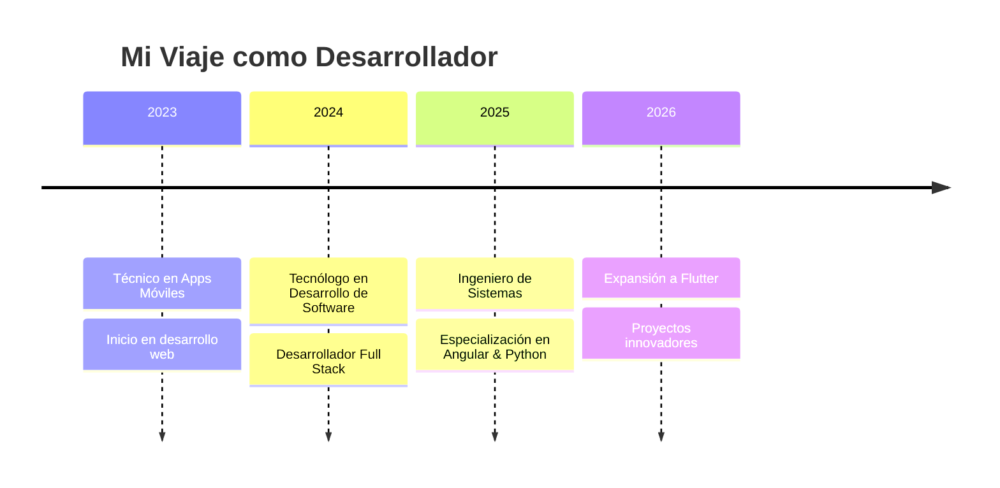
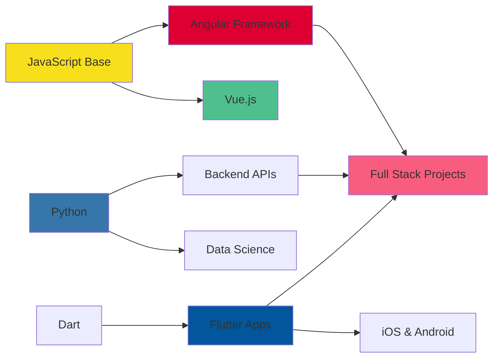

<div align="center">

<!-- Header con animación -->


<!-- Typing SVG -->
<a href="https://git.io/typing-svg"></a>
</br>

<!-- Animated GIF -->


<!-- Social Badges Animados -->
<p>
  <a href="https://www.linkedin.com/in/arielandresreyestuay/">
    
  </a>
  <a href="mailto:arielreyesdev593@gmail.com">
    
  </a>
  <a href="https://github.com/Andres-Reyes">
    
  </a>
</p>

<!-- Profile Views Counter -->


</div>

<br/>

<!-- Wave Separator -->


##  Sobre Mí

```javascript
const andresReyes = {
    ubicacion: "Colombia 🇨🇴",
    rol: "Desarrollador Full Stack Web",
    codigo: ["JavaScript", "Python", "Dart", "HTML", "CSS"],
    herramientas: ["Angular", "Vue.js", "Flutter", "Firebase", "Bootstrap"],
    aprendiendo: ["Angular", "Python", "Flutter"],
    educacion: [
        "🎓 Ingeniero de Sistemas",
        "💻 Tecnólogo en Desarrollo de Software",
        "📱 Técnico en Desarrollo de Apps Móviles"
    ],
    filosofia: "La tecnología es el arte de transformar ideas en realidad",
    disponible: "Abierto a colaboraciones en proyectos innovadores ✨"
};
```

<br/>

<!-- Wave Separator -->


## 💼 Trayectoria Profesional

<div align="center">



</div>

**📅 Actualmente**
- 🔭 **Desarrollador Full Stack Web** - Creando aplicaciones modernas y escalables
- 🎓 **Formación Continua** - Angular, Python y Flutter
- 💡 **Open Source** - Contribuyendo a la comunidad

<br/>

<!-- Wave Separator -->


## 🚀 Proyectos Destacados

<div align="center">

<!-- Project Cards - Actualiza con tus repos reales -->
<a href="https://github.com/Andres-Reyes">
  
</a>

<p>
  
</p>

</div>

<br/>

<!-- Wave Separator -->


##  Stack Tecnológico

<div align="center">

### 💪 Nivel de Habilidades

<table>
<tr>
<td width="50%">

#### Frontend


</td>
<td width="50%">

#### Backend & Mobile


</td>
</tr>
</table>

</div>

<div align="center">

### 🛠️ Herramientas y Tecnologías

#### Frontend Development
<p>
  
  
  
  
  
  
</p>

#### Backend & Database
<p>
  
  
  
</p>

#### Mobile Development
<p>
  
  
  
</p>

#### Tools & DevOps
<p>
  
  
  
  
</p>

</div>

<br/>

<!-- Wave Separator -->


## 🗺️ Roadmap de Aprendizaje 2026

<div align="center">



**🎯 Próximos Objetivos:**
- 🔥 Dominar Angular para aplicaciones empresariales
- 🐍 Python avanzado para backend y automatización
- 📱 Desarrollo multiplataforma con Flutter
- ☁️ Explorar servicios cloud (AWS/GCP)

</div>

<br/>

<!-- Wave Separator -->


## 🔨 Actualmente Construyendo

<div align="center">

<table>
<tr>
<td width="50%" valign="top">

### 💡 En Desarrollo
```yaml
proyecto: "Aplicaciones Web Modernas"
stack:
  - Angular
  - Firebase
  - Bootstrap
estado: "🚀 En progreso"
```

</td>
<td width="50%" valign="top">

### 📚 Aprendiendo
```yaml
skills:
  - name: "Angular Avanzado"
    progress: "████░░░░░░ 40%"
  - name: "Python Backend"
    progress: "██████░░░░ 60%"
  - name: "Flutter Mobile"
    progress: "███░░░░░░░ 30%"
```

</td>
</tr>
</table>

**🎯 Metas 2026:**
`[ ] Certificación Angular` `[ ] Dominar Python` `[ ] Publicar App Flutter` `[ ] Contribuir a OSS`

</div>

<br/>

<!-- Wave Separator -->


## 📊 Estadísticas de GitHub

<div align="center">

<!-- GitHub Stats Cards -->


<!-- Top Languages -->


<!-- Activity Graph -->


<!-- Trophy -->


</div>

<br/>

<!-- Wave Separator -->


## 🎯 Actualmente

<div align="center">

```diff
+ 🔭 Trabajando como Desarrollador Full Stack Web
+ 🌱 Aprendiendo Angular, Python y Flutter
+ 💼 Abierto a colaborar en proyectos web innovadores
+ 📫 Contacto: arielreyesdev593@gmail.com
+ ⚡ Fun fact: La mejor manera de predecir el futuro es crearlo
```

</div>

<br/>

<!-- Wave Separator -->


## 🐍 Contribution Snake

<div align="center">
  <picture>
    <source media="(prefers-color-scheme: dark)" srcset="https://raw.githubusercontent.com/Andres-Reyes/Andres-Reyes/output/github-contribution-grid-snake-dark.svg">
    <source media="(prefers-color-scheme: light)" srcset="https://raw.githubusercontent.com/Andres-Reyes/Andres-Reyes/output/github-contribution-grid-snake.svg">
    
  </picture>
</div>

<br/>

<!-- Wave Separator -->


## 💡 Cita del Día

<div align="center">

<!-- Dynamic Quote -->


</div>

<br/>

<!-- Wave Separator -->


## 🤝 ¡Conectemos!

<div align="center">

**¿Tienes un proyecto en mente? ¡Hablemos!**

<p>
  <a href="https://www.linkedin.com/in/arielandresreyestuay/">
    
  </a>
  <a href="mailto:arielreyesdev593@gmail.com">
    
  </a>
</p>


</div>
